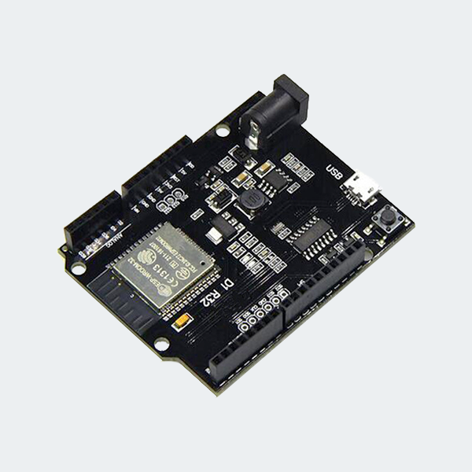

# ESPDuino32

Name     |ESPDUINO|pin|type|fonctions
---------|--------|---|----|-------------------------------------------------------------------------
EN       |  RST   | 3 |I   |Module-enable signal. Active high.
IO0      |        |25 |I/O |GPIO0  |          |       |                   ADC2_CH1  TOUCH1  RTC_GPIO11
TXD0     |  TXD   |35 |I/O |GPIO1  |U0TXD     |       |                                    
IO2      |  A0    |24 |I/O |GPIO2  |SD_DATA0  |HSPIWP | HS2_DATA0         ADC2_CH2  TOUCH2  RTC_GPIO12
RXD0     |  RXD   |34 |I/O |GPIO3  |U0RXD     |       |                                    
IO4      |  A1    |26 |I/O |GPIO4  |SD_DATA1  |HSPIHD | HS2_DATA1         ADC2_CH0  TOUCH0  RTC_GPIO10 
IO5      |  D10   |29 |I/O |GPIO5  |          |VSPICS0| HS1_DATA6                          
IO12     |  D8    |14 |I/O |GPIO12 |SD_DATA2  |HSPIQ  | HS2_DATA2   MTDI  ADC2_CH5  TOUCH5  RTC_GPIO15  
IO13     |  D9    |16 |I/O |GPIO13 |SD_DATA3  |HSPID  | HS2_DATA3   MTCK  ADC2_CH4  TOUCH4  RTC_GPIO14  
IO14     |  D7    |13 |I/O |GPIO14 |SD_CLK    |HSPICLK| HS2_CLK     MTMS  ADC2_CH6  TOUCH6  RTC_GPIO16  
IO15     |  IO15  |23 |I/O |GPIO15 |SD_CMD    |HSPICS0| HS2_CMD     MTDO  ADC2_CH3  TOUCH3  RTC_GPIO13 
IO16     |  D5    |27 |I/O |GPIO16 |U2RXD     |       | HS1_DATA4  
IO17     |  D4    |28 |I/O |GPIO17 |U2TXD     |       | HS1_DATA5  
IO18     |  D13   |30 |I/O |GPIO18 |          |VSPICLK| HS1_DATA7
IO19     |  D12   |31 |I/O |GPIO19 |U0CTS     |VSPIQ  |
IO21     |  SDA   |33 |I/O |GPIO21 |          |VSPIHD |
IO22     |  SCL   |36 |I/O |GPIO22 |U0RTS     |VSPIWP |
IO23     |  D11   |37 |I/O |GPIO23 |          |VSPID  | HS1_STROBE
IO25     |  D3    |10 |I/O |GPIO25 |          |       |                   ADC2_CH8  DAC_1   RTC_GPIO6
IO26     |  D2    |11 |I/O |GPIO26 |          |       |                   ADC2_CH9  DAC_2   RTC_GPIO7
IO27     |  D6    |12 |I/O |GPIO27 |          |       |                   ADC2_CH7  TOUCH7  RTC_GPIO17
IO32     |  IO32  | 8 |I/O |GPIO32 |XTAL_32K_P|       |                   ADC1_CH4  TOUCH9  RTC_GPIO9
IO33     |  IO33  | 9 |I/O |GPIO33 |XTAL_32K_N|       |                   ADC1_CH5  TOUCH8  RTC_GPIO8
IO34     |  A3    | 6 |I   |GPIO34 |          |       |                   ADC1_CH6          RTC_GPIO4
IO35     |  A2    | 7 |I   |GPIO35 |          |       |                   ADC1_CH7          RTC_GPIO5
SENSOR_VP|  A4    | 4 |I   |GPIO36 |          |       |                   ADC1_CH0          RTC_GPIO0
SENSOR_VN|  A5    | 5 |I   |GPIO39 |          |       |                   ADC1_CH3          RTC_GPIO3
